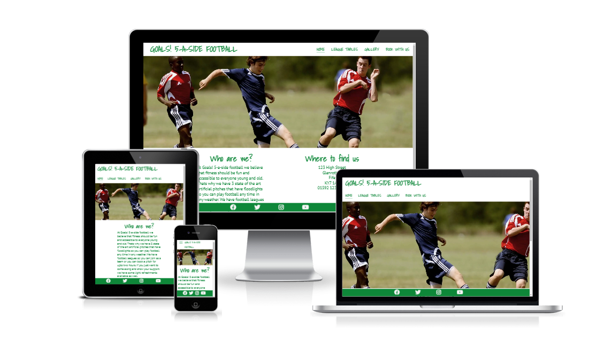
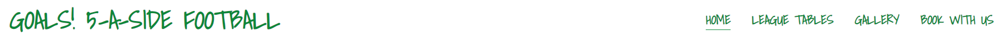
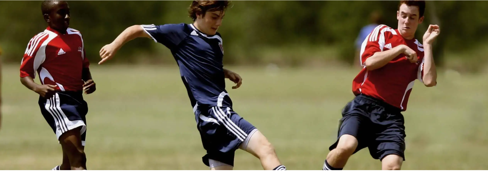
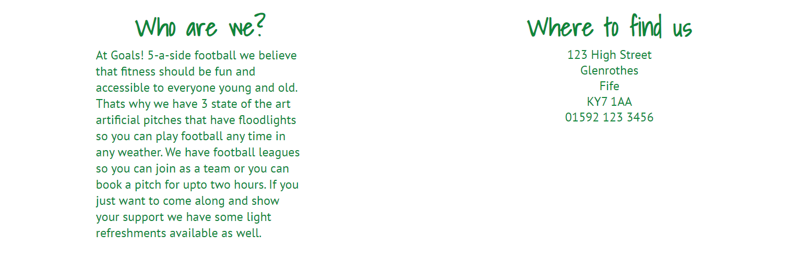
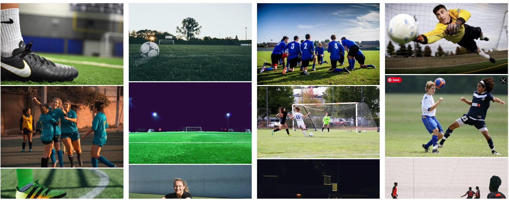
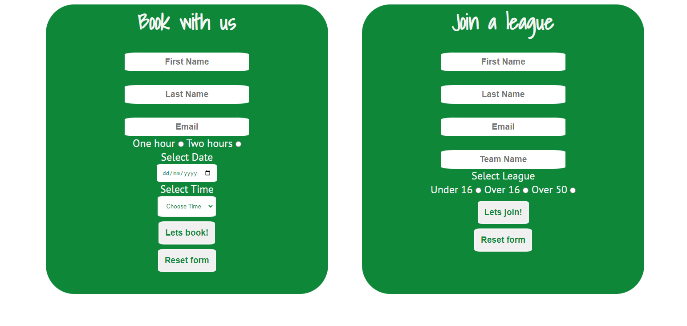

# Goals! 5-a-side football

Goals! 5-a-side football is a website for a five a side football league based in Fife Scotland. It provides an easy way to join a football league with your own team, see the current league standings and also the ability to rent a football pitch for upto two hours at a time. The landing page has an about us section and also the address of the company. There are an additional three pages to access the league table standings, gallery, booking and joining form.

The primary goal of the website is to get people from all walks of life to sign up to join a league or rent a football pitch. Also to give people easy access to professional pictures taken from the games that have been played. 

## Existing features

### Navigation bar

  * Fully functional navigation bar featured on 4 pages includes the name of the website and links to each page in the site . It is identical on each page for easy navigation.
  * It allows the user to navigate the site without the use of a "back" button with the current page being underlined as a visual aid for the current page.
  * The font used is the same as all headings and sub headings on website for clear continuity

### Main image on landing page

  * The main image on the landing page is of two males playing football to give a clear indication of what the site cators for.
  * The image conveys a sense of what the site is about, football, teamplay and fun.

  

### Who are we section and where to find us.

  * Short paragraph explaining what the site is for. With some unique selling points added in to give visitors to the site a clear, concise view of what you can experience if you book a pitch or join a league.
  * Where to find us is on the landing page so it makes it easy for potential customers to find the location.

  

### Footer and social media links

  * The footer section includes four social media links for the company which all open in a new tab.
  * The footer is fixed to show on the bottom of the screen at all times encouraging the user to click the social media links and engage with the company in more ways.
  * The footer is identical on every page to keep familiarity on the site.

  

### League tables page

  * The league tables page shows up to date league tables.
  * This makes it easy for members of the leagues to see up to date results in a clear way.
  * This drives repeat users to the site with an emotional attachment to see how there team compares to the other teams in the league.

  

### Gallery page
 
  * The gallery shows professionally taken pictures from moments within the football matches.
  * This drives an emotional response from the site visitors to see their own pictures.

  

### Book with us page
  
  * The book with us page gives an easy and clear way to rent a pitch on a specific date and time. It also gives an easy and clear way to join a league with your own team.
  * These options make life easier for the site user as they can do things themselves quickly.

  

