# Goals! 5-a-side football

Goals! 5-a-side football is a website for a five a side football league based in Fife Scotland. It provides an easy way to join a football league with your own team, see the current league standings and also the ability to rent a football pitch for up to two hours at a time. The landing page has an about us section and also the address of the company. There are an additional three pages to access the league table standings, gallery, booking and joining form.

The primary goal of the website is to get people from all walks of life to sign up to join a league or rent a football pitch. Also to give people easy access to professional pictures taken from the games that have been played. 

## Existing features

### Navigation bar

  * Fully functional navigation bar featured on 4 pages includes the name of the website and links to each page in the site . It is identical on each page for easy navigation.
  * It allows the user to navigate the site without the use of a "back" button with the current page being underlined as a visual aid for the current page.
  * The font used is the same as all headings and sub headings on website for clear continuity

### Main image on landing page

  * The main image on the landing page is of three males playing football to give a clear indication of what the site cators for.
  * The image conveys a sense of what the site is about, football, teamplay and fun.

  

### Who are we section and where to find us.

  * Short paragraph explaining what the site is for. With some unique selling points added in to give visitors to the site a clear, concise view of what you can experience if you book a pitch or join a league.
  * Where to find us is on the landing page so it makes it easy for potential customers to find the location.

  

### Footer and social media links

  * The footer section includes four social media links for the company which all open in a new tab.
  * The footer is fixed to show on the bottom of the screen at all times encouraging the user to click the social media links and engage with the company in more ways.
  * The footer is identical on every page to keep familiarity on the site.

  

### League tables page

  * The league tables page shows up to date league tables.
  * This makes it easy for members of the leagues to see up to date results in a clear way.
  * This drives repeat users to the site with an emotional attachment to see how there team compares to the other teams in the league.

  

### Gallery page
 
  * The gallery shows professionally taken pictures from moments within the football matches.
  * This drives an emotional response from the site visitors to see their own pictures.

  

### Book with us page
  
  * The book with us page gives an easy and clear way to rent a pitch on a specific date and time. It also gives an easy and clear way to join a league with your own team.
  * These options make life easier for the site user as they can do things themselves quickly.

  

### Hamburger menu

  * I added a hamburger menu that only appears on smaller screen sizes to improve readability of site

  

## Potential future features

  * Video highlights be added directly to website.
  * Bigger variety of football leagues.
  * Ability to pay on site for bookings.
  * Google maps added to the site to make finding the company easier.

## Wireframes 

 ### Below are wireframes that used to guide the design of the site although the site evolved quite a bit from these designs.

  * This is a rough site map so I knew what I wanted to include in the site.

  

  * The wireframe for the landing page.

  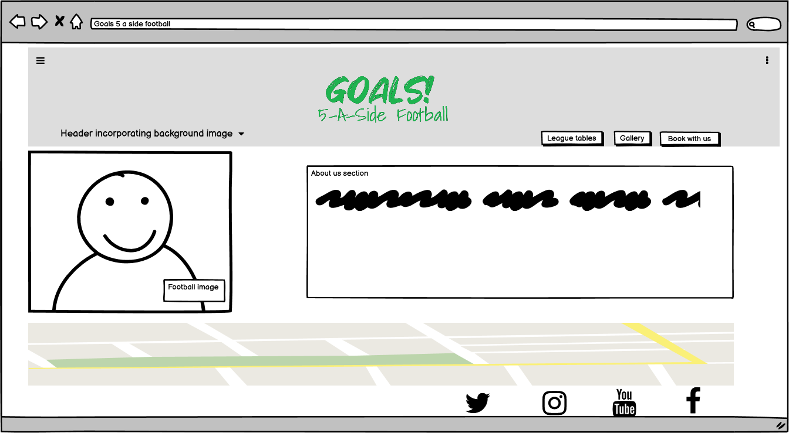

  * The wireframe for the league table page.

  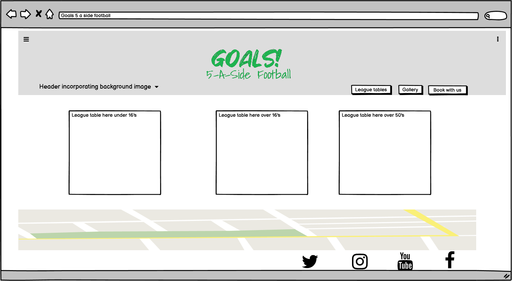

  * The wireframe for the gallery page.

  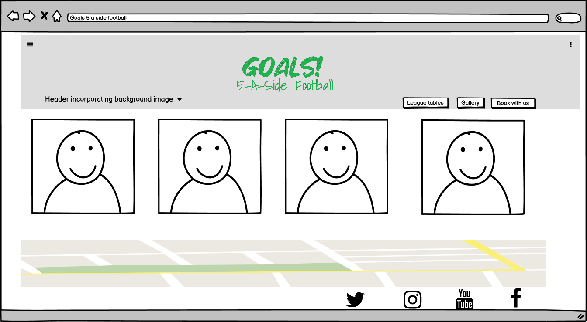

  * The wireframe for the book with us page.

  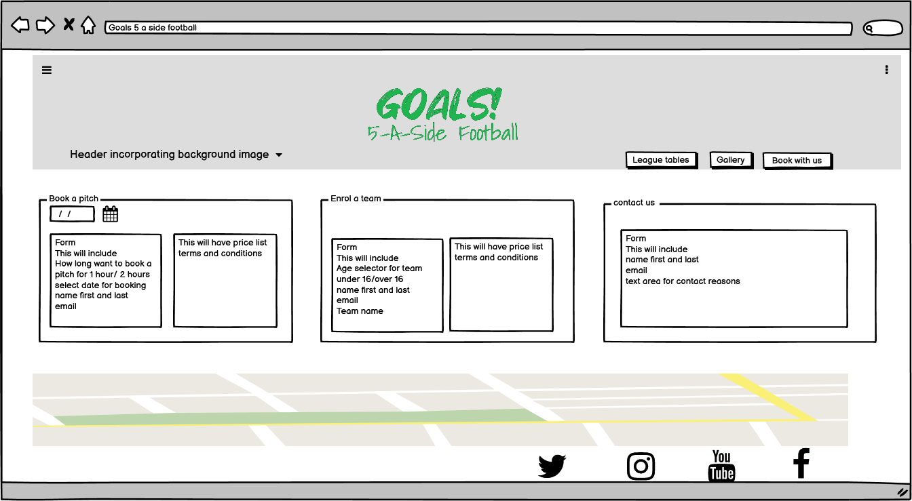

  * The wireframe for an ipad to see the site on a tablet device.

  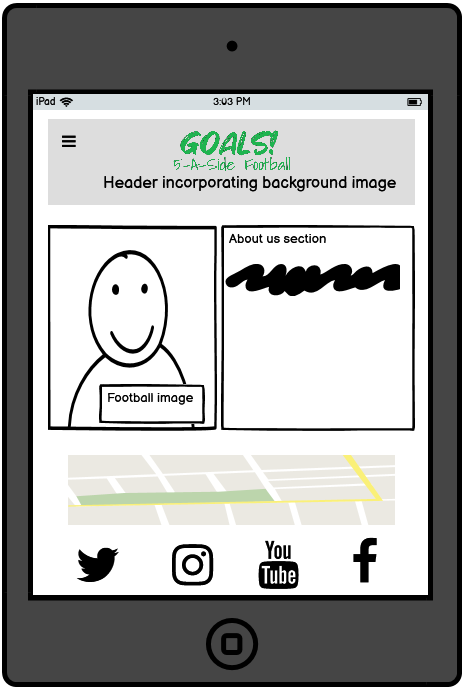

  * The wireframe for an iphone to see the site on a mobile device.

  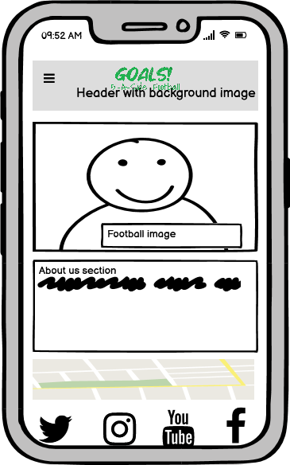

## Design choices

   I decided to keep to a theme of green font and foreground colours on a white background as green is the colour of football pitches. This also keep a clear continuity with the theme throughout the site so that navigation can be very easy to learn and becomes familiar quickly. I also wanted to not have too many elements on each page as well to help the user of the site navigate and not be distracted unnecessarily.

## Testing
  
I tested the site using the jigsaw css validater and the W3C html validater. All errors that were reported in the code have been fixed with pictures of the results below.

  * CSS validated home page

  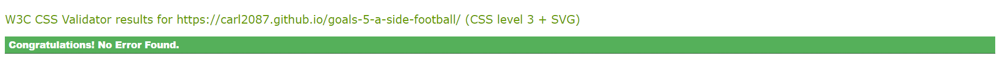

  * CSS validated league tables page

  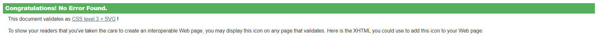

  * CSS validated gallery page

  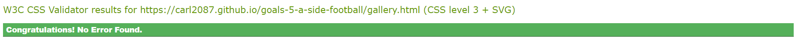

  * CSS validated book with us page

  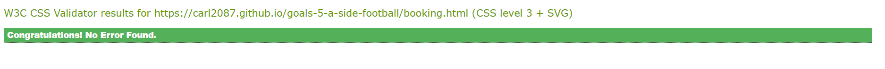

  * HTML validated landing page 

  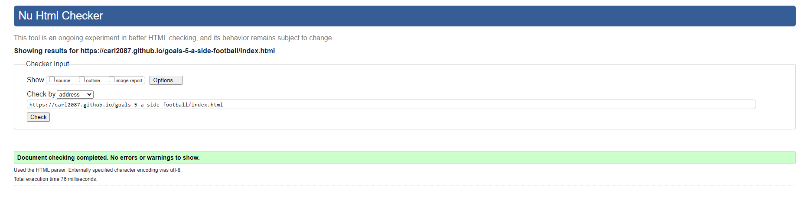

  * HTML validated league table page

  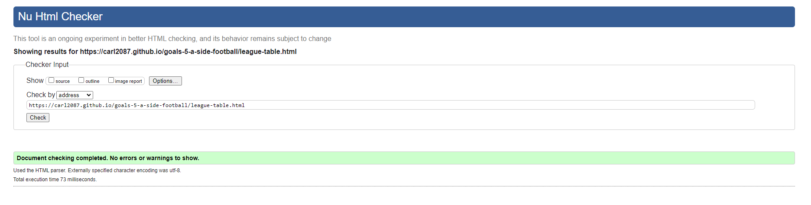

  * HTML validated gallery page

  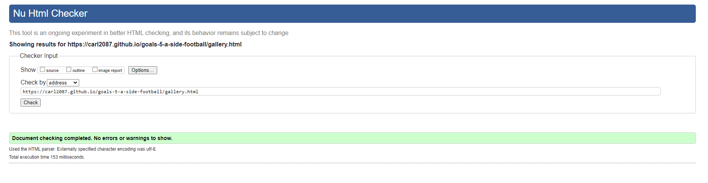

  * HTML validated book with us page

  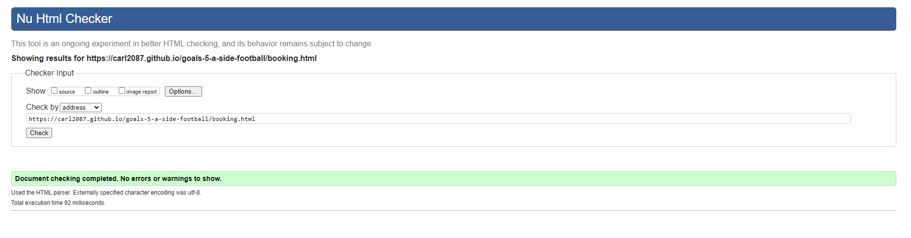

I also tested the site for mobile and desktop using Lighthouse which is part of the dev tools in Google Chrome browser, to get a quicker load time on mobile I ensured all images were compressed using the TinyPNG website.

  * Lighthouse results of the landing page on desktop and mobile

  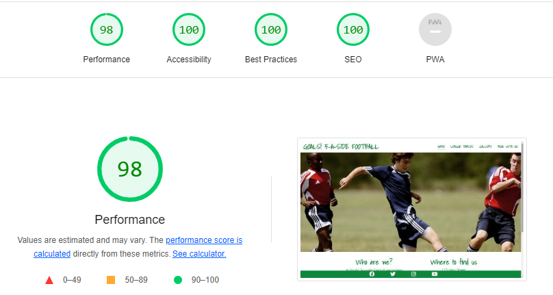
  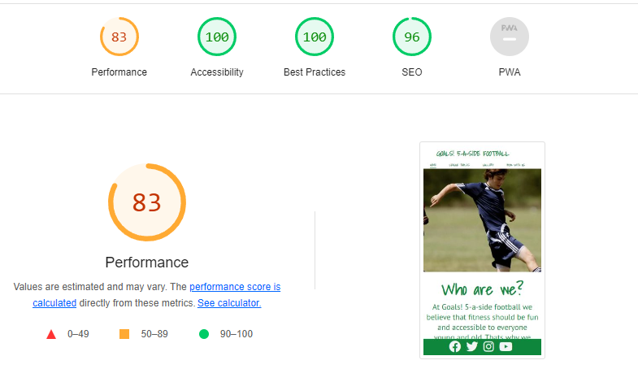
  
  * Lighthouse results of the league table page on desktop and mobile

  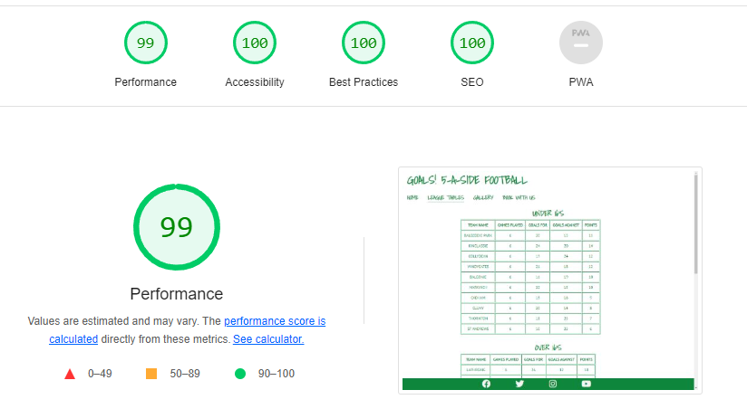
  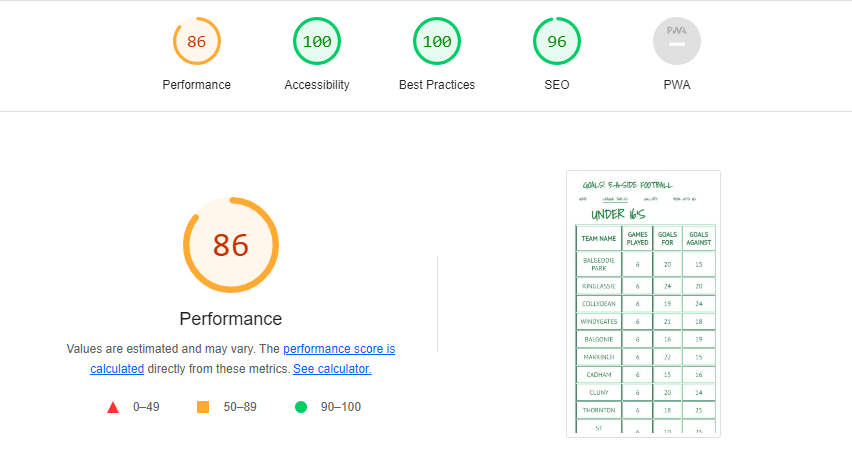

  * Lighthouse results of the gallery page on desktop and mobile

  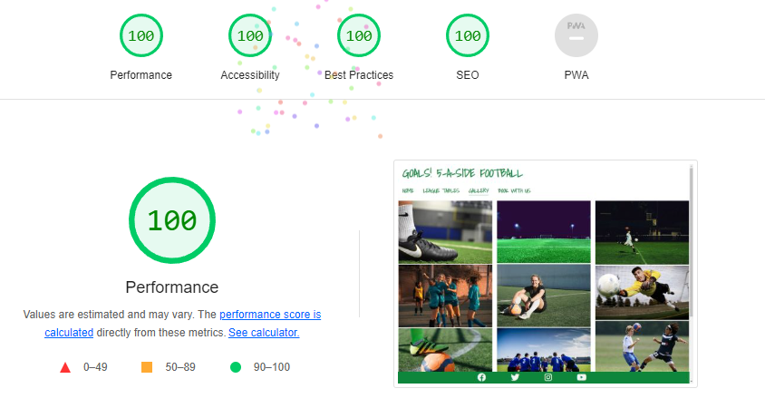
  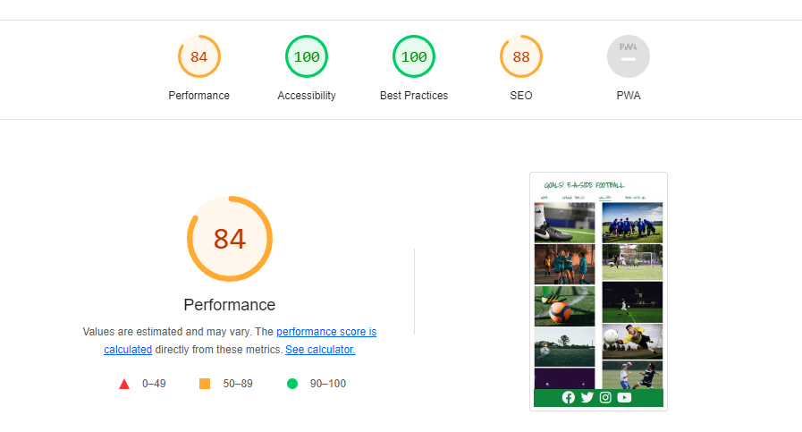

  * Lighthouse results of the book with us page on desktop and mobile

  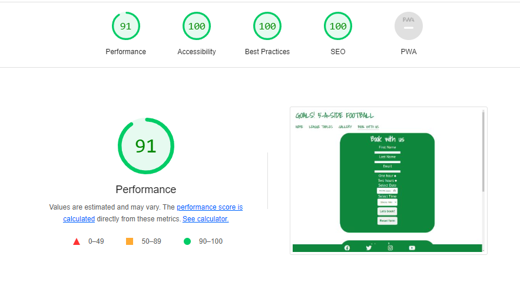
  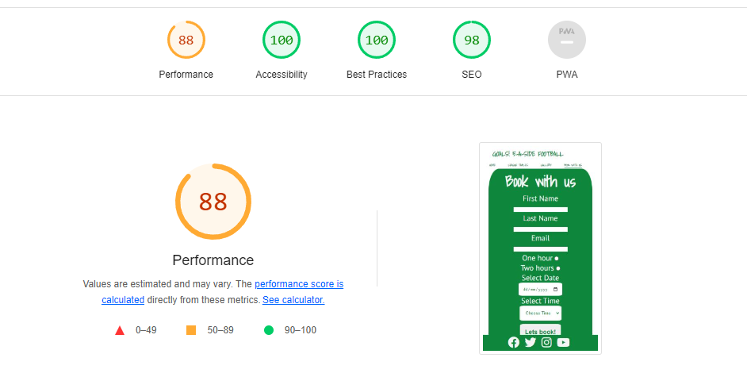

I tested the colour contrast on the site for accessibility using the website https://color.a11y.com/

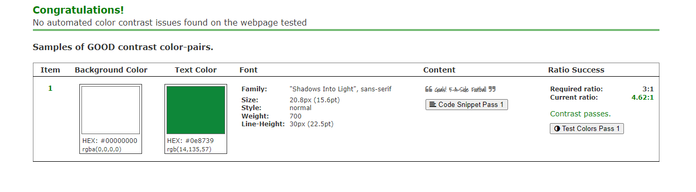

I also used the website [Am I responsive](https://ui.dev/amiresponsive) to check the responsive design of the site the image is at the top of the readme file.

## Bug fixes 

  * I found the gallery page was taking too long to load on mobile devices and a bit too long on desktops as well so I re-downloaded all of the images in a smaller size and also used https://tinypng.com/ to compress the images further to speed up loading times.

  * Upon deploying the website I found that my images were not loading in the gallery and my CSS was also not loading I found that the file paths were incorrect so updated all file paths to correct the error in the code.

  * I have tested the site extensively to ensure no bugs remain.

## Deployment

  I followed the steps below to deploy my website.

  1. Log into GitHub.
  2. Select the project repsitory I want to deploy.
  3. Select settings in the above menu.
  4. Select pages in the left hand side menu.
  5. In the source section, select branch Master and save.
  6. The page will produce the website URL that links to the site.

## Credits

### Website 

  * The name of the website was inspired by a 5 a side football league that has a facility in my home city of Liverpool.

  * The team names in the leagues are just town/city names and are not related to any real life football teams.

### Code

  * General code queries and issues were researched and answered with [W3 Schools](https://www.w3schools.com/) and [Stack Overflow](https://stackoverflow.com/) also Google to issues I had with placing my footer.

  * I used code from the Love running project to help with setting up the gallery page.

  * I used code from the Love running project to underline my active page in the header.

  * I used code from this website https://alvarotrigo.com/blog/hamburger-menu-css-responsive/ to make the hamburger menu  I chnged one or two lines of code 
    to suit my project as I only wanted the hamburger menu to appear on smaller device screens.

  * Notes made throughout the Code Institute course helped massively as well.

### Media 

  * All pictures on the website were downloaded royalty free from [Pexels](https://www.pexels.com/)

  * The footer icons were used from [Font Awesome](https://fontawesome.com/)

  * The font families used were from [Google Fonts](https://fonts.google.com/)

### Acknowledgements

I would like to thank my mentor Victor Miclovich who has given me great advice and is very clear in explaining processes. I would also like to thank the Code Institute Slack community who are always ready to help if needed.

